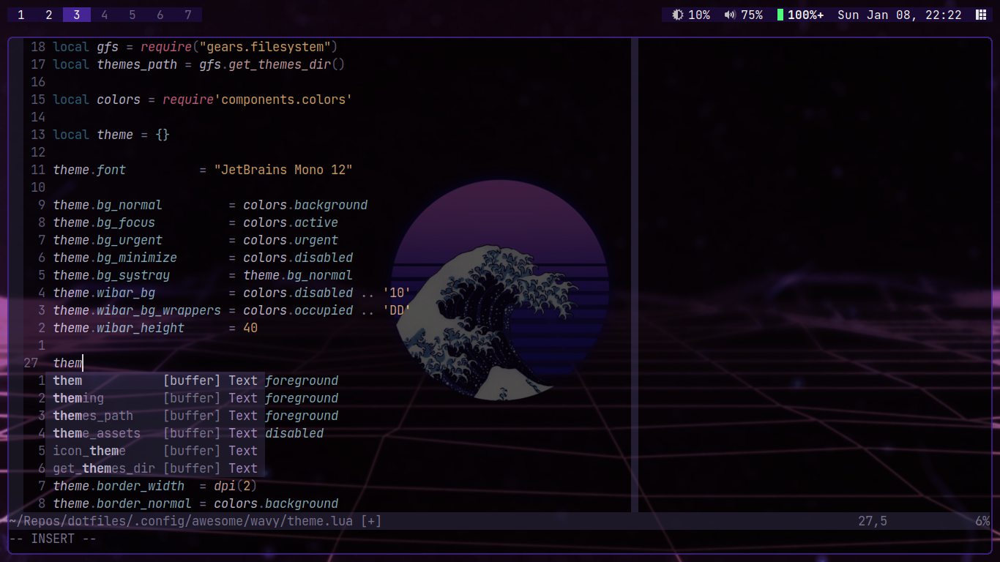
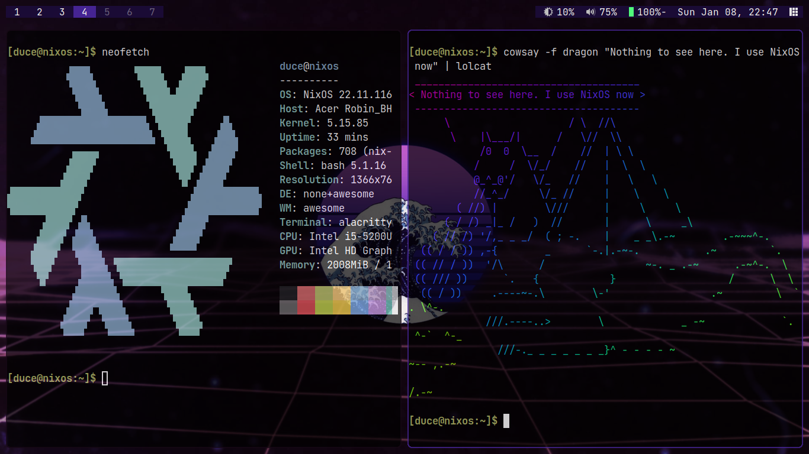
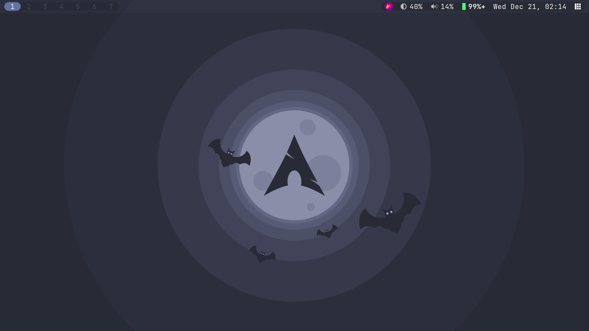
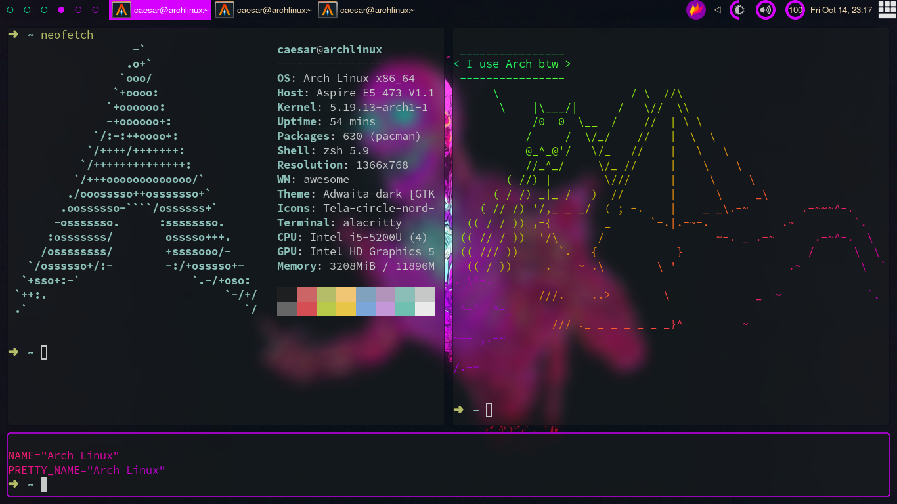
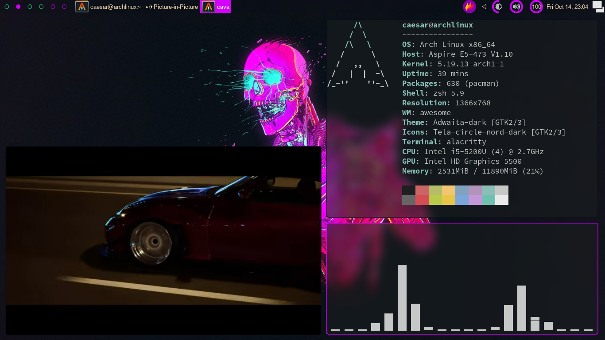

# awesomewm

A collection of my AwesomeWM config files for each of my setups based on them.

To use any the setups, follow the steps bellow:

1. Install `xorg-server`,  `xorg-xinit`,  `awesomewm` and an `x` compositor of your liking
2. Copy the contents of the desired setup to `~/.config/awesome/`

## Wavy

## Dracula

## Cyber

